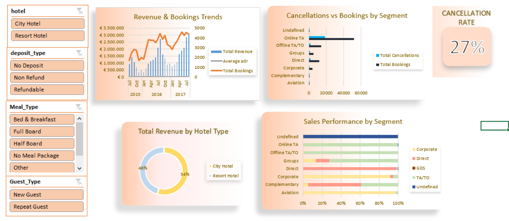

# Hotel Booking Demand & Cancellation Analytics

**Turning raw booking data into revenue-saving insights**

---

## Table of Contents
- [Project Overview](project-overview)
- [Business Problem & Objective](business-problem--objective)
- [Proposed Solution](proposed-solution)
- [Key Insights](key-insights)
- [Tools & Technologies](tools--technologies)
---

##  Project Overview

The hospitality industry is highly susceptible to booking fluctuations. One of the most critical challenges faced by hotel management is the **high volume of booking cancellations**, which directly impacts revenue potential and disrupts daily operations.

This project analyzes hotel booking data to uncover guest behavior patterns, identify key drivers of cancellations, and deliver actionable insights for revenue optimization.

---

## Business Problem & Objective

| | |
|---|---|
| 🔴 **The Problem** | The hotel experiences a significant baseline cancellation rate, making it difficult to forecast revenue and manage resources efficiently. |
| 🟢 **The Objective** | Design an interactive analytics dashboard that empowers hotel management to monitor key KPIs in real time, focusing on **Revenue Trends**, **Market Segment behavior**, and **Cancellation Rates**. |

---

## Proposed Solution

An interactive Excel-based dashboard built with advanced data modeling techniques, allowing stakeholders to dynamically slice and filter data by:

<table>
<tr>
<td> <b>Hotel Type</b> City Hotel vs. Resort Hotel</td>
<td> <b>Guest Type</b> New vs. Repeat Guest</td>
</tr>
<tr>
<td> <b>Deposit Type</b> No Deposit, Non-Refund, Refundable</td>
<td> <b>Meal Package</b> Guest meal preferences</td>
</tr>
</table>

---

## Key Insights

<table>
<tr>
<th align="left">Insight</th>
<th align="left">Finding</th>
</tr>
<tr>
<td> <b>Overall Cancellation Rate</b></td>
<td>Baseline cancellation rate stands at an alarming <b>27%</b></td>
</tr>
<tr>
<td> <b>Revenue Distribution</b></td>
<td>City Hotels drive <b>54%</b> of revenue, slightly outperforming Resort Hotels</td>
</tr>
<tr>
<td> <b>Market Segment Behavior</b></td>
<td><i>Online TA</i> (Travel Agents) is the largest booking driver — but also the top source of cancellations compared to <i>Direct</i> bookings</td>
</tr>
</table>

---

## Tools & Technologies

- **Data Cleaning & Transformation** — handled missing values (`#N/A`) using `IFERROR` and `VLOOKUP` integrations
- **Data Modeling** — connected disparate data sources using unified Pivot Caches
- **Data Visualization** — interactive PivotCharts with Neumorphism UI design principles for a modern, web-app-like experience
- **Interactive Elements** — synchronized Report Connections across multiple Slicers

---

---

